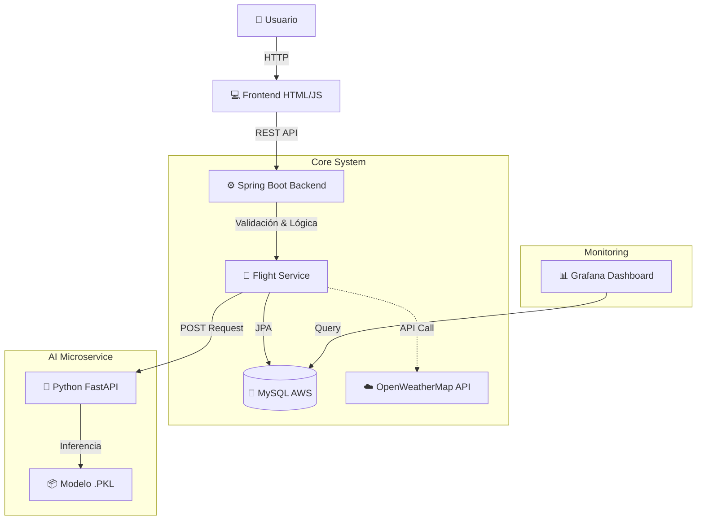

# ✈️ FlightOnTime

**Sistema Integral de Predicción de Retrasos Aéreos**


---

## 📖 Descripción del Proyecto

**FlightOnTime** es una solución Full Stack diseñada para abordar la incertidumbre en los viajes aéreos. Utilizando algoritmos de **Machine Learning**, el sistema predice la probabilidad de retraso de un vuelo basándose en factores históricos y meteorológicos.

El proyecto combina un backend robusto en **Java Spring Boot**, una interfaz de usuario intuitiva y un microservicio especializado en IA desarrollado en **Python**, todo desplegado en una infraestructura en la nube (**AWS**).

### 🚀 Problema que Resuelve
Los retrasos en los vuelos generan inconvenientes, pérdidas económicas y estrés. FlightOnTime permite a pasajeros y aerolíneas anticiparse a estos eventos mediante:
1.  **Predicción individual** en tiempo real.
2.  **Análisis masivo** de vuelos mediante archivos.
3.  **Monitoreo visual** de estadísticas y rendimiento del modelo.

---

## 🌐 Demo en Vivo (AWS)

El proyecto se encuentra desplegado y accesible públicamente en una instancia EC2 de AWS (Ubuntu):

*   🔗 **Frontend Principal**: http://www.flightontime.cl/
  

> ⚠️ **Nota:** Asegúrese de estar conectado a una red que permita tráfico HTTP a IPs directas.

---

## 🛠️ Stack Tecnológico

El sistema utiliza una arquitectura de microservicios híbrida:

### 🎨 Frontend
*   **HTML5 / CSS3 / JavaScript (Vanilla)**: Interfaz ligera y responsive, servida estáticamente por Spring Boot.
*   **Glassmorphism Design**: Estética moderna y visualmente atractiva.

### ⚙️ Backend (Core)
*   **Java 17**: Lenguaje principal.
*   **Spring Boot 3**: Framework para API REST, seguridad y gestión de datos.
*   **Spring Data JPA**: Abstracción para persistencia de datos.
*   **Maven**: Gestión de dependencias.

### 🤖 Inteligencia Artificial & ML
*   **Python**: Lenguaje para ciencia de datos.
*   **FastAPI**: Framework de alto rendimiento para exponer el modelo.
*   **Scikit-learn**: Librería utilizada para el entrenamiento y ejecución del modelo predictivo.
*   **Pandas / NumPy**: Procesamiento de datos.

### 💾 Base de Datos & Infraestructura
*   **MySQL**: Base de datos relacional para almacenar historial de predicciones y metadatos.
*   **AWS EC2 (Ubuntu)**: Servidor virtual para despliegue de producción.
*   **Grafana**: Plataforma de observabilidad conectada a MySQL para visualizar métricas y estadísticas del sistema en tiempo real.

### 🔌 APIs Externas
*   **OpenWeatherMap**: Obtención de datos meteorológicos en tiempo real para enriquecer las predicciones.
*   **Google Generative AI (Gemini)**: Automatización de la comunicación con el usuario, transformando estadísticas de retrasos en mensajes personalizados y empáticos.
---

## 🏗️ Arquitectura del Sistema

El flujo de información sigue un diseño modular:



### Flujo de Datos
1.  El usuario ingresa los datos del vuelo (Aerolínea, Origen, Destino, Fecha, Hora).
2.  El **Backend (Spring Boot)** recibe la petición y valida los datos.
3.  Se consulta el **Microservicio Python** para obtener la predicción (`Retraso` / `No Retraso`) y el nivel de probabilidad.
4.  El resultado se almacena en la **Base de Datos MySQL**.
5.  **Grafana** lee estos datos para generar reportes en tiempo real.
6.  El usuario recibe la respuesta visual en el navegador.

---

## 📂 Estructura del Repositorio

```bash
FlightOnTime/
├── python-service/         # 🐍 Microservicio de Inteligencia Artificial
│   ├── app/                # Código de la API Python (FastAPI)
│   └── requirements.txt    # Dependencias de Python
├── src/                    # ☕ Código fuente del Backend (Java/Spring) y Frontend
│   ├── main/java           # Lógica de negocio, Controladores, Entidades
│   └── main/resources/static # Frontend (HTML, CSS, JS)
├── README.md               # Este archivo
└── pom.xml                 # configuración Maven
```

---

## 🚀 Instalación y Ejecución Local

Para ejecutar el proyecto en tu máquina local, sigue las guías detalladas de cada módulo:

### 1️⃣ Microservicio de IA (Python)
Instrucciones para configurar el entorno Python y cargar el modelo.
👉 **[Ver Guía del Microservicio](python-service/README.md)**

### 2️⃣ Backend y Frontend
Instrucciones para levantar el servidor Java y la interfaz web.
👉 **[Ver Guía del Backend](src/README.md)**

> **Requisito previo**: Debes tener MySQL instalado localmente o acceso a una instancia remota.

---

## 📊 Visualización de Datos (Grafana)

El proyecto integra **Grafana** conectado directamente a la base de datos de producción en AWS. Esto permite visualizar:
*   Cantidad de predicciones realizadas por día.
*   Aerolíneas con mayor índice de retrasos probables.
*   Distribución de predicciones (A tiempo vs. Retrasado).
*   Métricas de uso del sistema.

---

## ✨ Características Principales

*   ✅ **Predicción en Tiempo Real**: Respuesta inmediata sobre el estado probable de un vuelo.
*   ✅ **Procesamiento por Lotes**: Carga de archivos CSV para analizar múltiples vuelos simultáneamente.
*   ✅ **Datos Meteorológicos**: Integración real con APIs de clima.
*   ✅ **Validación Robusta**: Manejo de errores y validación de datos de entrada.
*   ✅ **Interfaz Moderna**: Diseño limpio y fácil de usar.

---

### 👥 Equipo
Proyecto desarrollado como parte del **Hackathon de Alura Latam (Oracle)**.

**Equipo**: H12-25-L-Equipo 24 - FlightOnTime

---
© 2026 FlightOnTime. Todos los derechos reservados.
